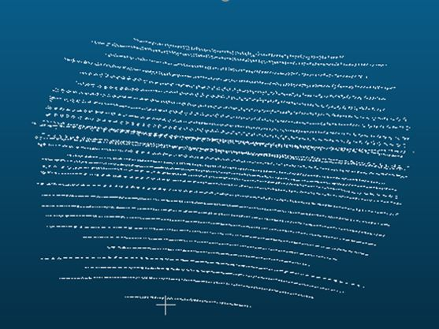
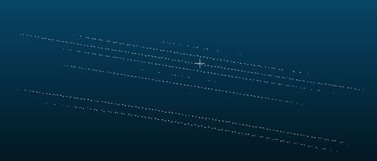

# OBSLID (OBStacle LIDdar) : The [ESIGELEC](https://www.esigelec.fr/)) with the found from the [CARNOT ESP INSTITUDE](http://www.carnot-esp.fr/)) has developped a system to evaluate the lidar performances in case of high or low reflectivity

## News :
* A new dataset with lidar Pandar 128 is availaible Layer [here](#Pandar128)
* A new dataset with lidar Pandar 40 is availaible Layer [here](#Pandar40)
* A new dataset with the vlp16 will be available soon
* Results are abailaible [here](#results)

## Experiment :

The tests were done at severall distances with several angle (yaw) between the lidar and the reflectity system.

The distances of test are :
* 0.5 m with yaw of 0 degrees
* 1 m with yaw of 0 degrees
* 1 m with yaw of 45 degrees
* 2 m with yaw of 0 degrees
* 2 m with yaw of 45 degrees
* 31 m with yaw of 0 degrees
* 31 m with yaw of 45 degrees

The two plate with calibrated reflictivity are 10% and 90% of reflectivity

For each test, a record with an occultation system was done to know the reference number of point that the lidar return:

Since the occulation system is removed and the number of point returned by the lidar are counted, in some case the number of return point can be very low like in the following exemple:

A second test is done to estimate the the effect of the reflectivity on the point measurement accuracy. An ROI (Region Of Interest) on only one layer is done (to be sure to not be distubed by the calibration differences between layers). Then, A linear interpolation is done on the ROI line. The error of projection of each point is processed to evaluate the effect of the reflectivity on the point measurement accuracy

Vincent VAUCHEY¹

¹[ESIGELEC](http://www.esigelec.fr/) , IRSEEM, Rouen, France, Normandie Univ, UNIROUEN, 

vauchey@esigelec.fr

Special Thanks to the members of the [SIRD](http://www.esigelec.fr/en/node/113) team : Marc DEHAIS, Anthony DESHAIS, Christophe ALEGRE, Pascal FALLA, Jérémy FOURRE

# Datasets
Dataset Lidar done by [ESIGELEC](http://www.esigelec.fr/).

#### DATASET 2020/01/10 Pandar128: 
* A dataset with lidar Pandar 128 is availaible Layer (0.5, 1, 2 et 31m)
  **  [Pandar 128 (Download)](https://esigelec-my.sharepoint.com/:u:/g/personal/vauchey_esigelec_fr/Ea9ZcGnBk6RIi1W0VDGpE1IB-C651Uu0xRZ7diqyBYqxyA?e=INGezK)

#### DATASET 2020/01/10 Pandar40: 
* A dataset with lidar Pandar 40 is availaible Layer (0.5, 1, 2 et 31m)
  ** [Pandar 40 (Download)](https://esigelec-my.sharepoint.com/:u:/g/personal/vauchey_esigelec_fr/EcuiAwBcePNAtcPCsUHNiW4BAh54745wT9-1xPChlhzSNQ?e=cc2JR4)

Directory Tree :
* .csv : Lidars point cloud, can be opened in ascii mode with cloudcompare
* no position modification were done beetween points tests called "carton" and tests associated
* line directory contain file .txt wich are roi on one layer, processLine.py file calculate the error between the points and the estimated linear interpolatin

# Results

Some resutls obtained on severall lidar are availaible here

#### results on pandar 128:

#### results on pandar 40:

The low reflectivity seems to have an important effect on the number of point returned by the Lidars, expecially with the pandar 128.
High or low reflectivities seems to have few effect on the point accuracy.

